<div align="center">

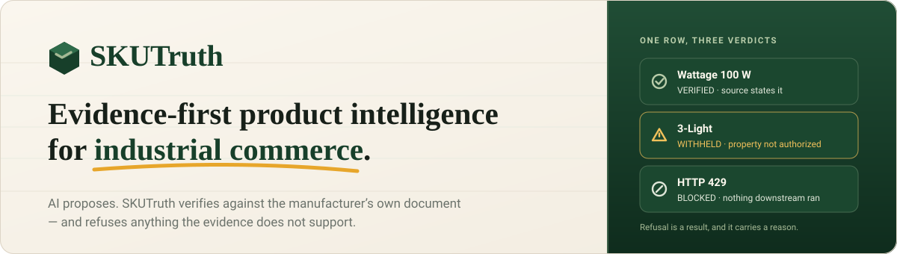

**AI proposes. SKUTruth verifies. Unilog's rules decide the final format.**

SKUTruth turns messy industrial catalogue rows into Unilog-ready product content, and
requires every enriched fact to be backed by the manufacturer's own document — or refuses
to state it.

[Judge path](#60-second-judge-path) ·
[Screenshots](#the-product) ·
[Architecture](#architecture) ·
[API](#the-submission-api) ·
[Quick start](#quick-start) ·
[Codebase atlas](#codebase-atlas) ·
[Limitations](#limitations)

<sub>
UniHack 2026 · built on the organizer's own 1,000-row catalog ·
Python 3.12 · FastAPI · Next.js 15 · Gemini via Vertex AI
</sub>

</div>

---

##  Verified project status

Every number here was recomputed from this repository while writing this file. Nothing is
carried over from an earlier draft.

| | | |
|---|---|---|
| **1,000** organizer rows | **999** distinct part numbers | **6** input columns |
| **252** delivery columns | **50** attribute triplets | **2** specimen rows |
| **3** real organizer demo cases | **7** verified facts on the deepest case | **3** refusals on that same case |
| **1,596** backend tests passing | **23** frontend tests passing | **14** pages in the production build |
| **11** frontend routes | **5** API routes | **0** external calls in the default mode |

Reproduce them: `python -m pytest`, `npm test --prefix frontend`,
`npm run build --prefix frontend`, and `python scripts/build_demo_cases.py --check`.

---

##  What SKUTruth is

A distributor row looks like this:

```
Mfg_Part_Num  Part_Desc                E1_Brand  Unilog_Brand  DIB_Brand  Part_Manuf
45297BK       45297BK Kichler Wall Lt  -- --     -- --         -- --      Kichler Lighting (KICLI)
```

Forty characters of abbreviated description, three brand columns that are mostly
placeholders, and a manufacturer name with a supplier code stapled to it. The delivery
format asks for 252 columns, including fifty ordered attribute slots, five distinct
description forms, and units in Unilog's own vocabulary.

Filling that gap with a language model is easy, fast, and produces confident,
unfalsifiable output. The hard part — the part that decides whether the result can be
trusted into a PIM — is knowing **which of those proposals are actually supported**.

SKUTruth is the machinery for answering that question mechanically. A value reaches
"verified" only when the system has located it in a hashed, page-mapped manufacturer
document, checked that the document's own wording states that value under those operating
conditions, and confirmed the evidence belongs to the exact product in question.
Everything else is withheld with a reason a person can act on.

> A refusal is a result. `SOURCE_PROPERTY_NOT_AUTHORIZED` tells a data steward what to fix.
> A silently invented value tells them nothing, and costs them a recall.

---

<a id="60-second-judge-path"></a>

##  60-second judge path

The fastest way to see the thing that makes SKUTruth different.

1. Start the API and the frontend — see [Quick start](#quick-start). No credentials, no
   cloud account, no organizer data pack needed.
2. Open **Analyze Catalog** at `http://localhost:3000/workbench`.
3. Click **Try the sample catalog instantly**, then **Prepare catalog**.
4. Find Kichler `45297BK` — it carries a *Full replay available* badge — and click **Analyze**.
5. Read the journey counts: **10 proposals → 10 source-bound → 7 verified → 3 withheld → 0 delivery-mapped**.
6. Open the **Withheld** tab and read `3-Light`.

That last one is the point. The model proposed `3-Light`. The manufacturer's own page
contains the literal string `3-Light`. SKUTruth **refuses it anyway**, because the source
property carrying that value is named `"Attribute"` — a generic label that does not prove
*which* property the value belongs to.

Then compare the other two cases: `62-1875` (blocked by an HTTP 429, nothing downstream
ran) and `SHOP/4X2/840/V1` (official pages found, but the site spells the reference with
hyphens and a slash is not a hyphen).

Three organizer rows. Three completely different honest outcomes.

---

##  Built on the organizer's real catalog

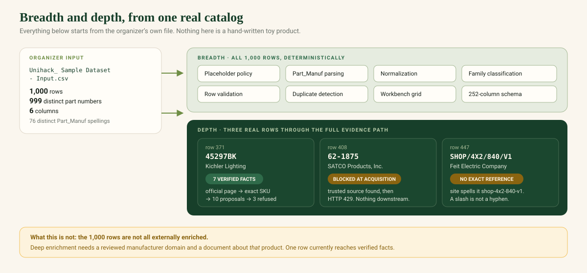

SKUTruth is built around the official UniHack data pack, not around invented sample data.

**`data/unilog_source/Unihack_ Sample Dataset - Input.csv`** — verified directly:
1,000 data rows, 999 distinct `Mfg_Part_Num` values, 6 columns
(`Mfg_Part_Num`, `Part_Desc`, `E1_Brand`, `Unilog_Brand`, `DIB_Brand`, `Part_Manuf`),
and 76 distinct `Part_Manuf` spellings.

The file drives:

| Used for | How |
|---|---|
| Raw catalog ingestion | streaming CSV reader with explicit header validation |
| Placeholder handling | `-- … --` anywhere; a bare `-` only in `Part_Manuf` (observed on 41/1,000 rows) |
| Manufacturer parsing | `Kichler Lighting (KICLI)` → name + supplier code, five typed outcomes |
| Normalization | injected canonical rules; unknown names stay `REVIEW`, never guessed |
| Classification | exact lexical cues in `Part_Desc` → internal routing family |
| Duplicate and row validation | `READY` / `REVIEW` / `INVALID` in the Workbench |
| Workbench compatibility | the six fields *are* the Workbench's schema contract |
| Choosing the real cases | the three demo products are organizer rows 371, 408 and 447 |

**The three demo products are real rows from the organizer's file.** Kichler `45297BK`
(row 371), SATCO `62-1875` (row 408), and Feit `SHOP/4X2/840/V1` (row 447). They were not
hand-created to make a demo work; they were selected because a reviewed manufacturer
domain exists for each, and because they fail in three different, instructive ways.

The approach splits deliberately:

- **Breadth** — all 1,000 rows go through deterministic normalization, validation and
  classification. This needs nothing but the file.
- **Depth** — selected real rows go through official manufacturer discovery, source
  acquisition, exact SKU identity, AI proposal and deterministic verification. This needs
  a reviewed domain and a document about *that specific product*.

Against the organizer input as it stands today: **959** rows carry both a usable part
number and a resolvable manufacturer name, **334** of those are searchable through a
configured domain, and **99** may license manufacturer evidence because their
manufacturer entry carries a human review (Kichler 56, SATCO 41, Feit 2). That number
moves when a person reviews a domain, not when more code is written.

> **We do not claim "1,000 products fully enriched."** The repository does not support
> that, and the code refuses to pretend otherwise.

### The expected-output file

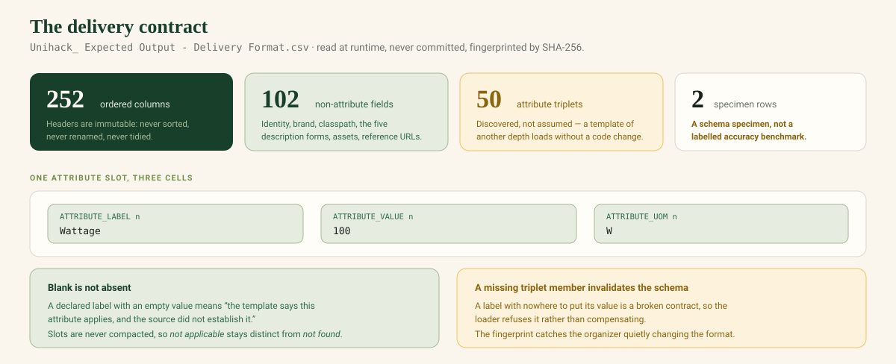

**`data/unilog_source/Unihack_ Expected Output - Delivery Format.csv`** — verified
directly: **252 ordered columns**, of which **150** form **50** `ATTRIBUTE_LABEL n` /
`ATTRIBUTE_VALUE n` / `ATTRIBUTE_UOM n` triplets and **102** are non-attribute fields,
plus **2** populated example rows.

**The organizer's Expected Output file is treated as a delivery-schema specimen, not as a
labelled benchmark.** Two rows cannot support a field-level accuracy figure, so none is
computed and none is claimed. What the file *is* used for:

- header ordering and the exact export sequence (the portal says do not modify the headers);
- the delivery contract itself, derived at runtime by `DeliverySchema.from_csv()`;
- the attribute-triplet structure, whose count is discovered rather than assumed;
- blank/default semantics — a declared label with an empty value means *applies, not found*;
- schema validation and round-trip testing.

The 252 header names are **not** checked into this repository. The organizer pack carries
no stated redistribution grant, so `data/unilog_source/` is gitignored and the schema is
read from the local file. That also buys a real property: `fingerprint()` — SHA-256 over
the ordered header names — detects the organizer quietly changing the format.

---

##  Why this is hard

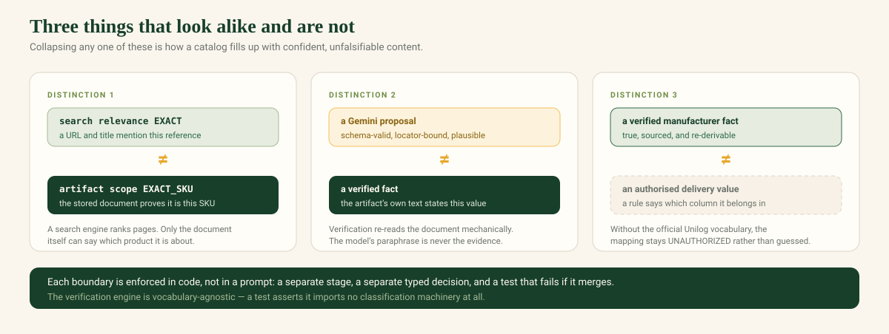

Three distinctions carry the whole design. Collapsing any one of them is how a catalog
fills up with confident, wrong content.

**1. Search relevance `EXACT` ≠ artifact scope `EXACT_SKU`.**
A search result whose URL and title mention the reference tells you a page is *worth
looking at*. Only the stored document itself can establish that it is *about that product*.
SKUTruth keeps these in different modules with different vocabularies, and nothing
downstream runs until the artifact-level check passes.

**2. A Gemini proposal ≠ a verified fact.**
The model returns schema-valid, locator-bound, entirely plausible output. That output is
kept in a list literally named `proposed`, and it never merges with `verified`.
Verification re-reads the stored document mechanically; the model's paraphrase is never
the evidence.

**3. A verified manufacturer fact ≠ a Unilog-authorized delivery value.**
`Wattage = 100 W` can be true, sourced and re-derivable, and still have no authorized
place in the delivery format, because the official Unilog attribute vocabulary that would
say where it goes is not in the supplied pack. Those facts carry
`unilog_mapping_status = UNAUTHORIZED` rather than being written into a plausible-looking
column.

---

<a id="the-product"></a>

##  The product

<table>
<tr>
<td width="50%">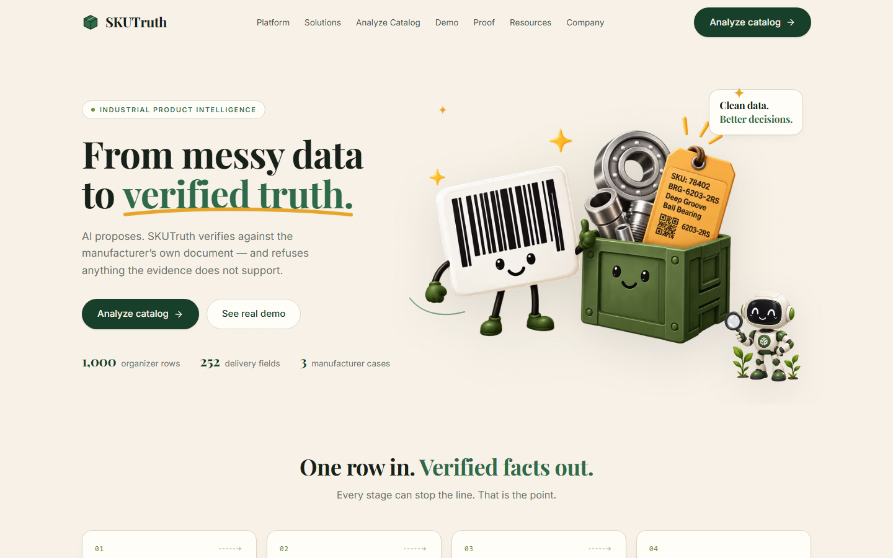<br><sub><b>Home.</b> The problem, the pipeline, and the three real cases.</sub></td>
<td width="50%">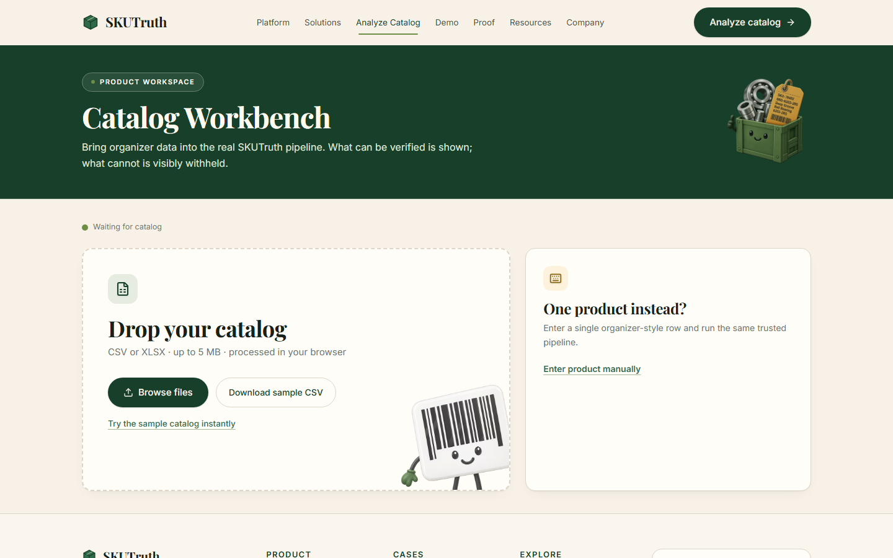<br><sub><b>Catalog upload.</b> CSV or XLSX, parsed in the browser. Manual single-row entry beside it.</sub></td>
</tr>
<tr>
<td width="50%">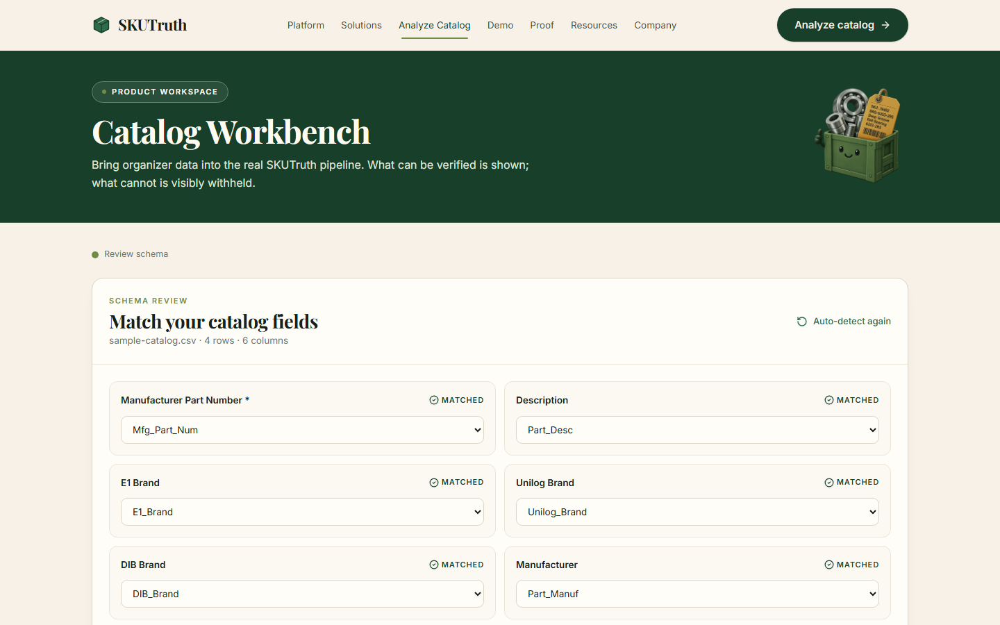<br><sub><b>Schema review.</b> Columns auto-detected by alias, always editable before anything runs.</sub></td>
<td width="50%">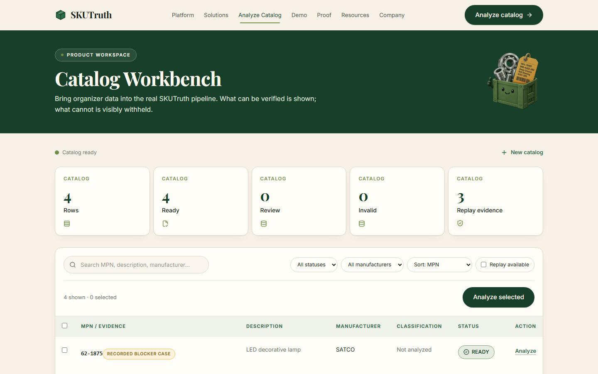<br><sub><b>Catalog grid.</b> Row status, replay-evidence badges, search, filters, multi-select.</sub></td>
</tr>
<tr>
<td width="50%">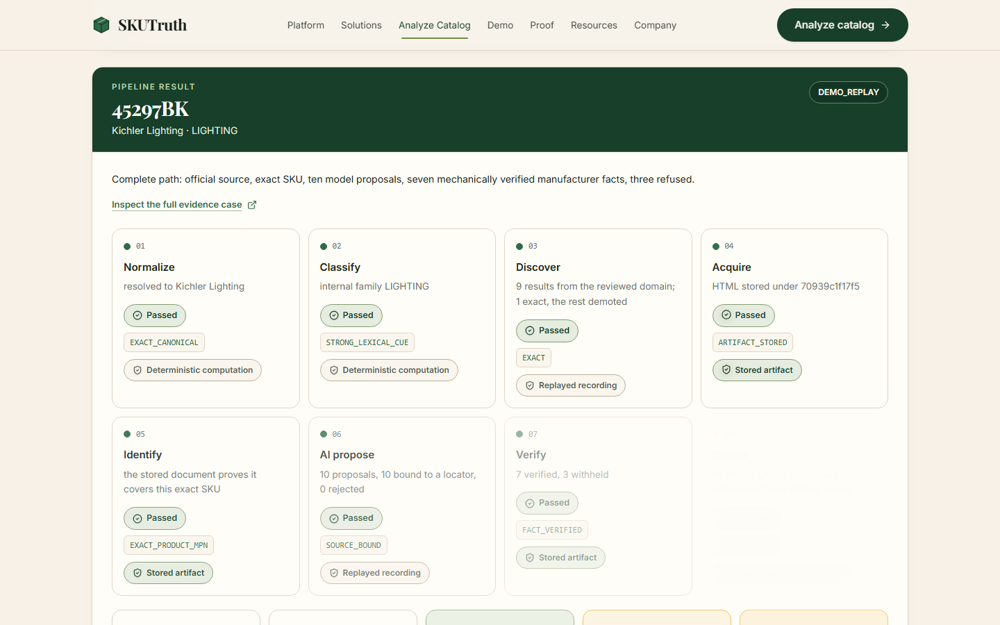<br><sub><b>Result workspace.</b> The stage timeline and the journey counts for one row.</sub></td>
<td width="50%">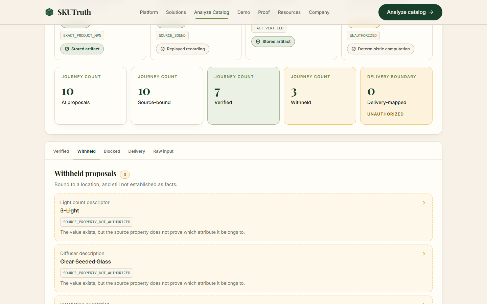<br><sub><b>Withheld.</b> 10 → 10 → 7 → 3 → 0, and the reason each refusal happened.</sub></td>
</tr>
<tr>
<td width="50%">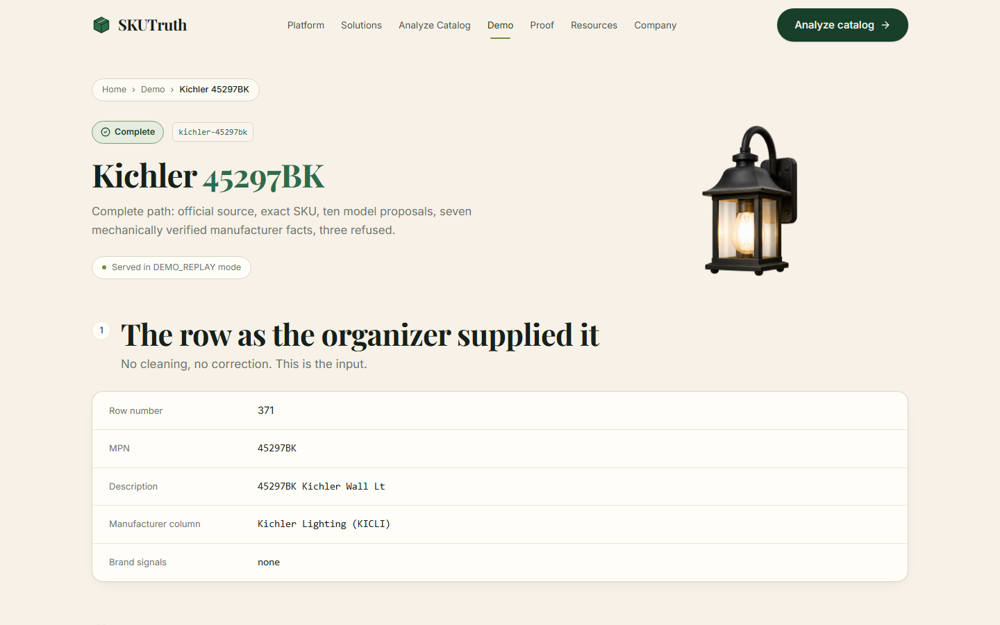<br><sub><b>Kichler 45297BK.</b> The complete journey, stage by stage.</sub></td>
<td width="50%">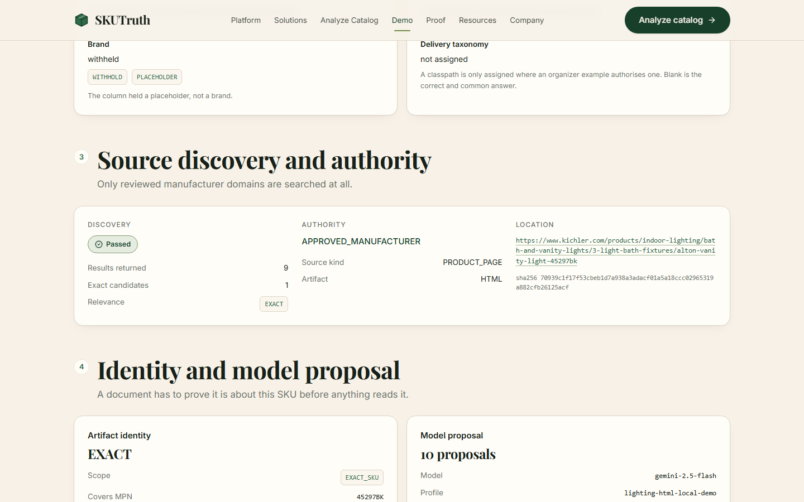<br><sub><b>Discovery and identity.</b> Authority, source kind, artifact hash, exact-SKU scope.</sub></td>
</tr>
<tr>
<td width="50%">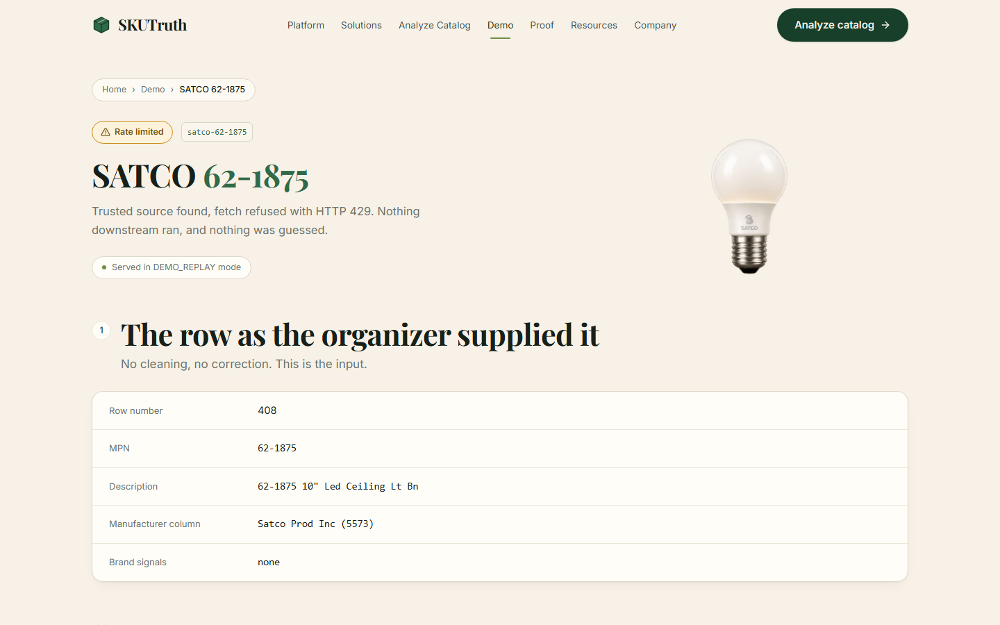<br><sub><b>SATCO 62-1875.</b> Blocked at acquisition, and honest about why.</sub></td>
<td width="50%">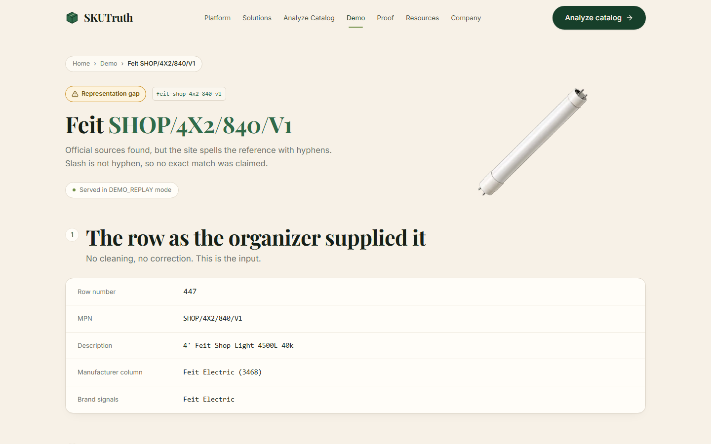<br><sub><b>Feit SHOP/4X2/840/V1.</b> A representation gap, not a match.</sub></td>
</tr>
<tr>
<td width="50%">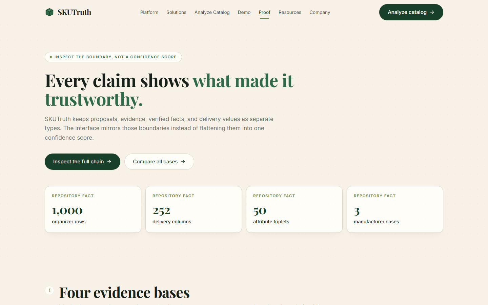<br><sub><b>Proof.</b> What the system checks, and what it refuses to claim.</sub></td>
<td width="50%">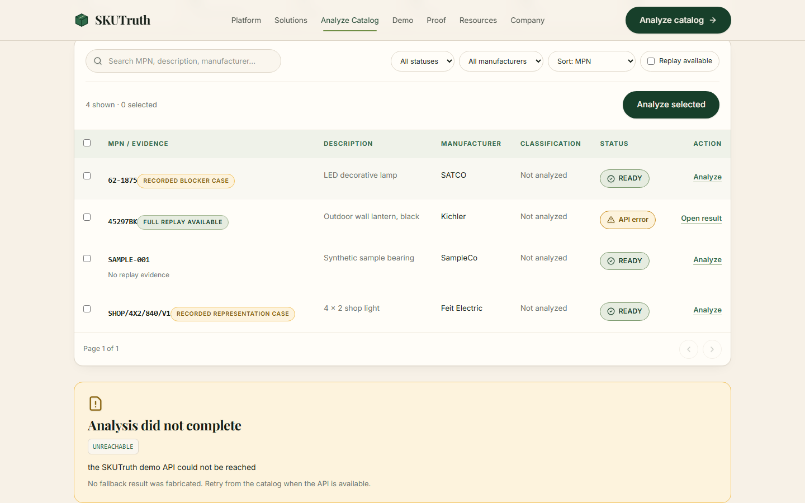<br><sub><b>API unreachable.</b> The row is marked. No fallback result is fabricated.</sub></td>
</tr>
</table>

---

##  The Catalog Workbench

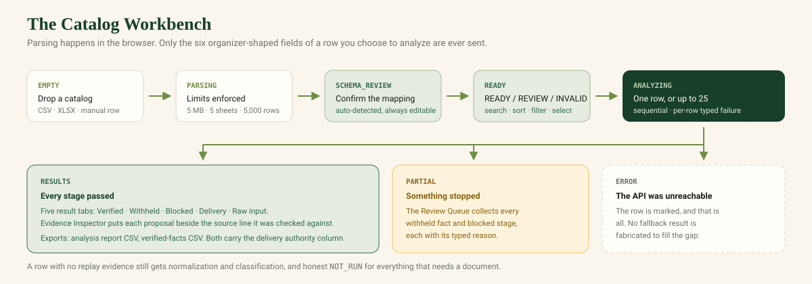

The Workbench brings organizer data into the real pipeline. Everything below is
implemented in [`frontend/src/components/workbench/`](frontend/src/components/workbench)
and [`frontend/src/lib/catalog.ts`](frontend/src/lib/catalog.ts).

<details>
<summary><b>Import and schema</b></summary>

| Capability | Detail |
|---|---|
| CSV upload | PapaParse, delimiter auto-detected, unclosed-quote detection |
| XLSX upload | `read-excel-file`, first sheet imported, remaining sheet names reported |
| Manual product entry | one organizer-shaped row, `Mfg_Part_Num` required |
| Drag and drop | with a distinct grabbing cursor while dragging |
| Sample catalog | 4 rows — the three real cases plus one synthetic row |
| File-type refusal | only `.csv` and `.xlsx`; executables, HTML, SQL and archives are refused |
| Size limit | 5 MB |
| Sheet limit | 5 sheets per workbook |
| Row limit | 5,000 rows |
| Column limit | 100 columns |
| Duplicate headers | disambiguated rather than silently overwritten |
| Schema auto-detection | alias table per field (`mpn`, `sku`, `part number`, `vendor`, …) |
| Manual mapping | every field re-assignable from a dropdown |
| Auto-detect again | resets the mapping without re-importing |
| Extra columns | preserved and reported, never discarded |

</details>

<details>
<summary><b>Catalog grid</b></summary>

| Capability | Detail |
|---|---|
| Row validation | `READY` / `REVIEW` / `INVALID`, each with listed issues |
| Issue detection | blank MPN, placeholder MPN, duplicate MPN, missing or placeholder manufacturer |
| Search | across MPN, description, manufacturer and E1 brand |
| Status filter | all / `READY` / `REVIEW` / `INVALID` |
| Manufacturer filter | built from the values actually present |
| Replay-availability filter | show only rows with stored evidence |
| Sort | by MPN, manufacturer or status, numeric-aware |
| Outcome filters | analyzed, verified, partial, blocked, review, no-evidence |
| Pagination | 20 rows per page |
| Multi-select | per row and select-all-visible; `INVALID` rows cannot be selected |
| Single analysis | per-row **Analyze** action |
| Batch analysis | up to 25 products, with an explicit message when the selection is larger |
| Responsive | a table above `md`, cards below |

</details>

<details>
<summary><b>Results, review and export</b></summary>

| Capability | Detail |
|---|---|
| Stage timeline | all 8 stages with status, typed reason and evidence basis |
| Journey counts | proposals, source-bound, verified, withheld, delivery-mapped |
| Verified tab | value, UOM, source label, locator and delivery authority |
| Withheld tab | proposed value, source label, typed reason and detail |
| Blocked tab | blocked stages with reason and evidence basis |
| Delivery tab | mapped count and the reason mapping is unauthorized |
| Raw input tab | the six organizer fields exactly as supplied |
| Evidence Inspector | each proposal beside the source fragment it was checked against |
| Review Queue | every withheld fact and every blocked or review stage, in one list |
| Recorded-observation badge | shown when a stage was observed live rather than re-derived |
| Analysis report CSV | MPN, manufacturer, classification, pipeline state, counts, blocker, reason |
| Verified facts CSV | MPN, attribute, value, UOM, source, verification, delivery authority |
| API-unavailable state | typed error code and message, and no fabricated fallback |
| Unknown-row handling | deterministic stages still run; the rest report `NOT_RUN` honestly |

</details>

**Where the data goes.** Parsing, validation, filtering, sorting and both CSV exports run
entirely in the browser. The only thing sent to the server is the six organizer-shaped
fields of a row you explicitly choose to analyze. The client never sends a URL or a
domain, because a client that could would be choosing what the server fetches.

---

##  End-to-end pipeline

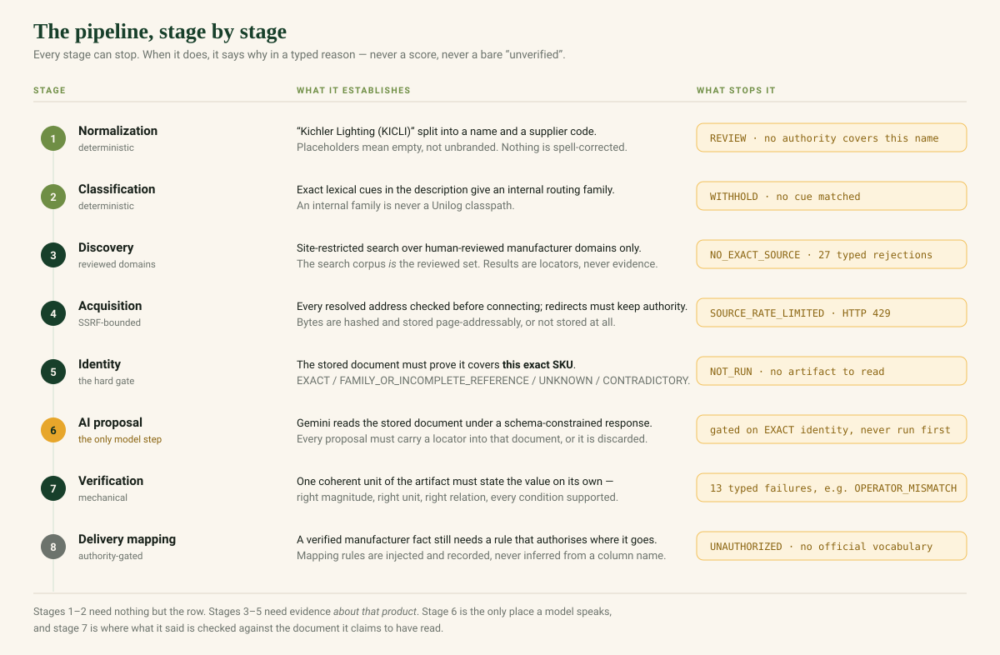

```
raw Unilog row
      ↓  placeholder policy · Part_Manuf structural parse
site-restricted search           human-reviewed domains only · locators, never evidence
      ↓  exact caller query · no model in the loop
manufacturer source discovery    approved domains only · exact reference required
      ↓  bounded, SSRF-checked acquisition
manufacturer artifact ingestion  bytes hashed · pages mapped · text preserved
      ↓
identity resolution              EXACT / FAMILY / UNKNOWN / CONTRADICTORY
      ↓  exact reference required before anything is enriched
Gemini structured extraction     schema-constrained proposals, through record/replay
      ↓
deterministic validation         units, picklists, ranges, condition completeness
      ↓
mechanical evidence verification EXACT_SPAN, or UNVERIFIED with a specific reason
      ↓
adjudication + explicit mapping  commit / withhold / review / unmapped
      ↓
252-column Unilog delivery record
```

That path runs end to end for attributes: a verified fact reaches an `ATTRIBUTE_LABEL` /
`ATTRIBUTE_VALUE` / `ATTRIBUTE_UOM` triplet in the organizer's real 252-column schema, and
a refused one reaches no cell.

**What that does not mean.** The mapping rules that decide where a fact goes are
hand-written and marked non-authoritative, because the official Unilog LOV, UOM master and
category attribute rules are not in the supplied pack. So SKUTruth can write verified
attributes into the official delivery schema through explicit mappings; it
cannot yet claim those attributes are Unilog-compliant, and the code refuses to pretend
otherwise.

### What the verification actually checks

Given a proposed fact, the verifier requires all of the following from **one coherent
unit** of a real artifact — one source line, or one table row with the headers above it:

- the artifact hashes to the digest the claim names, and its stored pages are intact;
- the model's quote occurs on the cited page, unambiguously;
- the **artifact's own text** — not the model's paraphrase — states the value, in a
  compatible unit, **with a matching relation** (`< 60 °C` is not `60 °C`);
- every bound operating condition is supported by that same unit;
- the evidence is bound to the exact product, by the document's scope or by a table row
  that identifies itself.

Failures are specific. There are 13 of them and never a bare "unverified", and never a
confidence score — the answer is not probabilistic:

`ARTIFACT_MISMATCH` · `ARTIFACT_UNREADABLE` · `PAGE_NOT_FOUND` ·
`SOURCE_FRAGMENT_NOT_FOUND` · `AMBIGUOUS_MATCH` · `VALUE_NOT_SUPPORTED` ·
`UNIT_NOT_SUPPORTED` · `OPERATOR_MISMATCH` · `CONDITION_NOT_SUPPORTED` ·
`TABLE_STRUCTURE_UNRESOLVED` · `PRODUCT_REFERENCE_MISMATCH` ·
`PRODUCT_SCOPE_NOT_SUPPORTED` · `UNSUPPORTED_VALUE_KIND`

See [`backend/skutruth/verification/README.md`](backend/skutruth/verification/README.md).

---

##  Three real cases

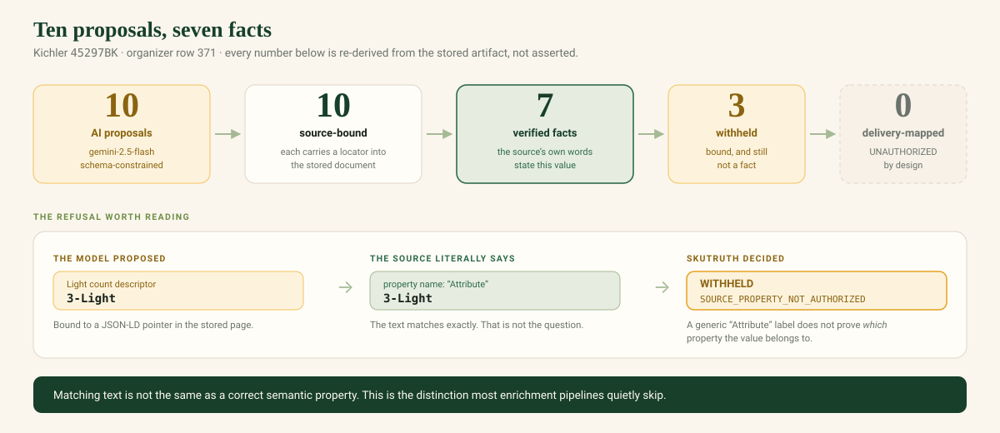

### Kichler `45297BK` — the complete path

Organizer row 371. `45297BK Kichler Wall Lt`, `Kichler Lighting (KICLI)`.

| Stage | Outcome | Basis |
|---|---|---|
| Normalization | `SUCCESS` · `EXACT_CANONICAL` → Kichler Lighting | deterministic |
| Classification | `SUCCESS` · `STRONG_LEXICAL_CUE` (`wall lt`) → `LIGHTING` | deterministic |
| Discovery | `SUCCESS` · `EXACT` — 9 results, 1 exact, the rest demoted | stored cassette |
| Acquisition | `SUCCESS` · HTML stored under `70939c1f17f5…` | stored artifact |
| Identity | `SUCCESS` · `EXACT_PRODUCT_MPN`, scope `EXACT_SKU` | stored artifact |
| AI proposal | `SUCCESS` · 10 proposals, 10 source-bound, 0 rejected | stored cassette |
| Verification | `SUCCESS` · **7 verified, 3 withheld** | stored artifact |
| Delivery mapping | `WITHHELD` · `UNAUTHORIZED` | deterministic |

The seven verified facts are overall depth, height and width, finish name, shade
dimensions, socket configuration and lamp wattage — each re-derived from the stored page,
each carrying a JSON-LD pointer or a text offset into that page.

**The refusal worth reading:**

| | |
|---|---|
| AI proposal | `3-Light` for *Light count descriptor* |
| Manufacturer source | property named `"Attribute"`, value `3-Light` |
| SKUTruth | **WITHHELD** — `SOURCE_PROPERTY_NOT_AUTHORIZED` |
| Reason | *'Attribute' is not an exact reviewed property alias for this key* |

The value is right there in the source. The text matches exactly. That is not the
question. A generic `"Attribute"` label does not establish **which** semantic property the
value belongs to, so SKUTruth will not bind it to *Light count descriptor*. Matching text
is not a correct semantic property — this is the distinction most enrichment pipelines
quietly skip.

### SATCO `62-1875` — blocked at acquisition

Organizer row 408. Discovery succeeded: 10 results, 2 exact candidates, authority
`APPROVED_MANUFACTURER`, relevance `EXACT`, pointing at the official SATCO spec sheet.

The fetch came back **HTTP 429**. No document was stored, so no artifact existed. Identity
did not run. The model did not run. Verification did not run. Delivery mapping did not
run. Nothing was guessed to fill the gap.

That acquisition stage is the one place in the whole demo record marked
**`RECORDED_OBSERVATION`** — a person watched it happen in a live run and wrote it down,
because *an HTTP 429 cannot be replayed*. Every other stage in the record is either
re-derived deterministically now, or read from a stored cassette or artifact. The UI shows
this distinction rather than flattening it.

### Feit `SHOP/4X2/840/V1` — the representation gap

Organizer row 447. Agent Search returned official `feit.com` product pages under
`APPROVED_MANUFACTURER` authority. The pages exist. The manufacturer is right.

The locator spells the reference `shop-4x2-840-v1`. The organizer row spells it
`SHOP/4X2/840/V1`. **The relevance policy does not treat a slash and a hyphen as the same
character**, so no exact reference was established, no document was acquired, and nothing
downstream ran.

This is deliberately conservative. Inferring `/` = `-` is exactly the kind of quiet
normalization that produces a confident enrichment against the wrong SKU.

---

<a id="architecture"></a>

##  Architecture

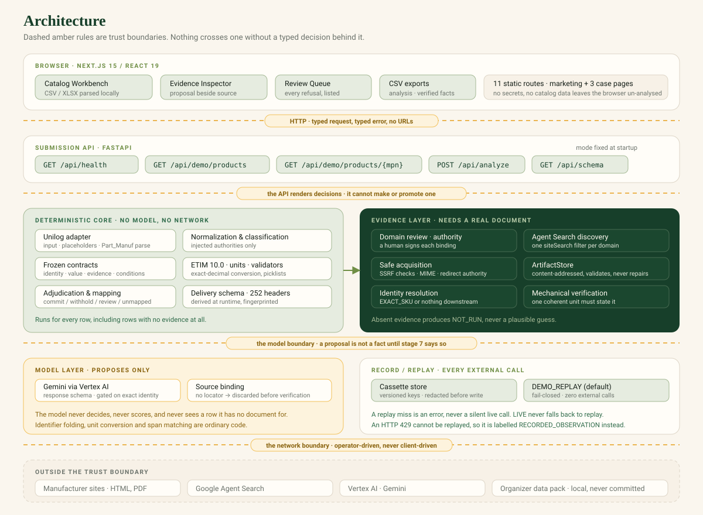

### Tech stack

| Layer | Choice | Why |
|---|---|---|
| Backend | Python 3.12, FastAPI, Pydantic v2 | frozen typed contracts; refuses malformed states at the boundary |
| Frontend | Next.js 15, React 19, Tailwind v4, TypeScript | 14 statically generated pages, no client secrets |
| Motion | Framer Motion | entry animation only; disabled under `prefers-reduced-motion` |
| Catalog parsing | PapaParse, `read-excel-file` | runs in the browser, so raw catalogs never need to be uploaded |
| Classification reference | ETIM 10.0 (vendored, ODC-BY 1.0) | 5,640 classes, 17,377 features, 188 units, 16,163 values |
| Search | Google Agent Search basic website search | caller's query runs verbatim; one `siteSearch` filter per reviewed domain |
| Model | Gemini 2.5 Flash via Vertex AI | schema-constrained structured output, gated on exact identity |
| PDF | `pypdf`, with `pdfplumber` for ruled tables | MIT-licensed; deliberately not PyMuPDF, which is AGPL-or-commercial |
| Tests | pytest (1,596), Vitest + Testing Library (23) | no committed test reaches the network |

### Deliberately not used

Vector databases, retrieval-augmented generation, knowledge graphs, multi-agent
frameworks, message brokers, and fine-tuning. Datasheets are small enough for
whole-document extraction with a deterministic page map, and each omission is a recorded
engineering decision rather than an oversight.

Language models are used where interpretation is genuinely required — proposing facts into
a typed schema, reading ambiguous family or condition language. Identifier normalisation,
unit conversion, enumeration validation, span verification, hashing and cache keys are
deterministic code.

### Where ETIM fits

Unilog's format and vocabulary are the competition-facing output wherever the organizer
supplies them. ETIM is internal machinery: a working example of a class → ordered attribute
template, a reviewed unit registry and validation layer, and the right output for the
electrical vertical.

The verification engine is deliberately vocabulary-agnostic — a claim keyed
`unilog:Amperage Rating` verifies through exactly the same code as one keyed `EF001392`,
and a test enforces that the engine imports no ETIM class machinery. The ETIM 10.0 release
is vendored in `data/etim/` under ODC-BY 1.0; see `data/etim/ATTRIBUTION.md`, and
reproduce the counts with `python scripts/etim_stats.py`.

---

<a id="the-submission-api"></a>

##  The submission API

Five routes, deliberately. Every one answers a question somebody watching the demo
actually asks, and none exposes a lever that could spend budget, fetch an arbitrary URL,
or bypass the manufacturer review that licenses evidence.

The API is a **view** over the pipeline. It renders what the trust layers already decided.
Nothing in it can turn a model proposal into a fact.

### Execution modes

| Mode | What it does | External calls |
|---|---|---|
| `DEMO_REPLAY` *(default)* | deterministic stages plus the committed demo record | **none** |
| `LIVE` | live providers under the existing budgets | yes |

Set with `SKUTRUTH_API_MODE`. An unrecognised value is **refused at startup** rather than
defaulting quietly — a typo in a deployment variable must not produce a replay server
somebody believes is live. The mode is a *server* setting, never a request parameter.
**LIVE never falls back to replay**; a live failure stays a typed failure.

### Routes

<details open>
<summary><code>GET /api/health</code> — liveness, mode, and whether anything external is called</summary>

```bash
curl -s http://localhost:8000/api/health
```
```json
{"status":"ok","mode":"DEMO_REPLAY","version":"skutruth-api@v1","demo_cases":3,"external_calls":false}
```
Touches nothing outside the process. No external network calls.
</details>

<details>
<summary><code>GET /api/demo/products</code> — the three real cases with countable metrics</summary>

```bash
curl -s http://localhost:8000/api/demo/products
```
Returns a `DemoIndex`: one `ProductCard` per case plus the record-level metrics
(`organizer_rows`, `delivery_columns`, `attribute_triplets`,
`organizer_examples_populated`, `demo_cases`, and the Kichler counts). No external
network calls.
</details>

<details>
<summary><code>GET /api/demo/products/{mpn}</code> — one case in full</summary>

```bash
curl -s "http://localhost:8000/api/demo/products/45297BK"
curl -s "http://localhost:8000/api/demo/products/SHOP/4X2/840/V1"
```
`{mpn}` is a `:path` parameter **on purpose**: a real organizer MPN contains slashes, and
refusing to route it would hide one of the three cases. Returns the full `ProductDetail` —
timeline, normalization, classification, source, identity, AI counts, the three attribute
lists and the delivery verdict. `404` with `DEMO_CASE_NOT_FOUND` for anything else. No
external network calls.
</details>

<details>
<summary><code>POST /api/analyze</code> — analyse an organizer-style row</summary>

```bash
curl -s -X POST http://localhost:8000/api/analyze \
  -H 'Content-Type: application/json' \
  -d '{"mpn":"45297BK","description":"45297BK Kichler Wall Lt","manufacturer":"Kichler Lighting (KICLI)"}'
```
A row matching a demo case replays that case in full. **Any other row** gets the stages
computable from committed code and committed data — manufacturer normalization and product
classification — and honest `NOT_RUN` for everything downstream. Discovery, acquisition,
identity and verification need evidence about *that* product, and this endpoint will not
manufacture it.

The client supplies data, never a URL and never a domain. `422` with `INVALID_REQUEST`
returns field names and failure kinds only — never the submitted values. In `LIVE` mode an
unknown row returns `501 LIVE_MODE_UNAVAILABLE`, because the reviewed-domain gate, the call
budget and the acquisition policy are operator-driven. No external network calls in
`DEMO_REPLAY`.
</details>

<details>
<summary><code>GET /api/schema</code> — the delivery contract shape and the UI's vocabularies</summary>

```bash
curl -s http://localhost:8000/api/schema
```
Returns `delivery_columns`, `attribute_triplets`, `organizer_rows`,
`organizer_examples_populated`, the 8 `Stage` values, the 5 `StageStatus` values, the 4
`EvidenceBasis` values, and the trust note. No external network calls.
</details>

Interactive docs at `http://localhost:8000/docs`.

### Trust states

Every stage carries three separate things, and the UI shows all three:

- **`status`** — `SUCCESS` · `REVIEW` · `WITHHELD` · `BLOCKED` · `NOT_RUN`.
- **`reason`** — the internal typed reason, verbatim: `EXACT_PRODUCT_MPN`,
  `SOURCE_PROPERTY_NOT_AUTHORIZED`, `SOURCE_RATE_LIMITED`. Never softened into prose.
- **`evidence`** — `DETERMINISTIC` · `STORED_CASSETTE` · `STORED_ARTIFACT` ·
  `RECORDED_OBSERVATION`.

Attributes split into three lists that never merge: `proposed` (what the model said),
`verified` (what the stored source independently supports), and `withheld` (what survived
binding and still did not become a fact).

### Typed errors

One failure shape — `code`, `stage`, `message`, `retryable`, `details` — across nine codes:
`DEMO_CASE_NOT_FOUND`, `INVALID_REQUEST`, `REPLAY_NOT_AVAILABLE`, `SOURCE_RATE_LIMITED`,
`NO_EXACT_SOURCE`, `SOURCE_ACQUISITION_FAILED`, `IDENTITY_WITHHELD`,
`LIVE_MODE_UNAVAILABLE`, `LIVE_PROVIDER_FAILED`.

---

##  Frontend routes

| Route | What it is |
|---|---|
| `/` | the problem, the pipeline, the three cases, the trust boundaries |
| `/platform` | how the system works, stage by stage |
| `/solutions` | who this is for and what it changes |
| `/workbench` | **Analyze Catalog** — the interactive Workbench |
| `/demo` | the three real cases, side by side |
| `/demo/kichler` | complete journey to seven verified facts |
| `/demo/satco` | blocked at acquisition, HTTP 429 |
| `/demo/feit` | the slash-is-not-a-hyphen representation gap |
| `/proof` | what is checked, and what is deliberately not claimed |
| `/resources` | architecture, trust model and API reference |
| `/company` | why the project takes this position |

11 routes, 14 generated pages in the production build. All statically prerendered.

---

##  Security model

Verified controls, each implemented and tested:

| Control | Implementation |
|---|---|
| Server-side secrets | no credential is ever returned in a response; `redaction.py` scrubs before anything is persisted or keyed |
| Explicit CORS allowlist | `SKUTRUTH_API_ALLOWED_ORIGINS`; defaults to local dev ports, **no wildcard default** |
| No anonymous LIVE toggle | mode is read once at startup from the environment, never from a request |
| SSRF defence | `validate_url` checks scheme, host and **every resolved address**, IPv4 and IPv6, before connecting |
| Redirect validation | at most 5 redirects, and authority must survive each hop (`REDIRECT_AUTHORITY_LOST`) |
| Domain authority | only human-reviewed manufacturer domains may license evidence |
| Response size cap | 25 MB per fetch; 50 MB and 500 pages per ingested document |
| MIME validation | trusted post-fetch content type, never the filename or the URL |
| HTML ingestion | no scripts executed, no secondary network access, 5 MB / 100k elements / 100 JSON-LD blocks |
| Input validation | Pydantic contracts; `422` returns field names and failure kinds, never submitted values |
| File restrictions | `.csv` / `.xlsx` only, 5 MB, 5 sheets, 5,000 rows, 100 columns |
| Client-side parsing | catalogs are parsed in the browser; only chosen rows are sent |
| Batch limit | 25 products per public batch |
| No raw source exposure | absolute paths, GCP resource ids, cassette internals, raw page HTML and tracebacks are never returned; evidence excerpts are capped at 200 characters |
| Bounded work | 4 queries and 2 site queries per product, 10 results per query, 3 fetch attempts, 40 provider calls per process |

`tests/test_api.py` asserts each of those absences directly.

**No compliance certification is claimed.** This is a hackathon submission, not an audited
system.

---

##  Record and replay

Every external and model interaction goes through one wrapper.

- **Why it exists.** A demo that depends on a manufacturer's site being up, a search quota
  being unspent, and a model endpoint answering is a demo that fails in front of judges.
  More importantly, evidence that cannot be re-derived cannot be checked.
- **What it guarantees.** In `DEMO_REPLAY` the providers are never touched. A replay miss
  is a **typed error**, never a silent live call. Cassette keys are versioned and derived
  from a canonical, redacted request descriptor, so a changed request cannot quietly reuse
  an old recording.
- **What it does not guarantee.** Replay proves what *did* happen, not what *would* happen
  today. A manufacturer can change a page; the stored artifact does not update itself.

Four distinct things, kept distinct:

| | Meaning |
|---|---|
| `DETERMINISTIC` | re-computed right now from committed code and committed data |
| `STORED_CASSETTE` | a recorded provider interaction, replayed |
| `STORED_ARTIFACT` | re-read from a hashed, page-mapped stored document |
| `RECORDED_OBSERVATION` | a person watched it happen live and wrote it down — an HTTP 429 cannot be replayed |

**This is not fake data.** `data/demo/cases.json` holds the *derived* result of real runs —
typed outcomes, values and short evidence pointers — regenerated from the real evidence by
`scripts/build_demo_cases.py`. No source document, page HTML or cassette body is reproduced
in it, because that material is third-party and carries no redistribution grant.
`tests/test_api.py` re-derives the whole record whenever the evidence is present and fails
if the committed file has drifted.

---

<a id="quick-start"></a>

##  Quick start

**Prerequisites:** Python 3.12 and Node.js 20+. That is all — the default mode needs no
cloud credentials, no environment variables, and no organizer data pack.

<details open>
<summary><b>Backend</b></summary>

```bash
uv venv --python 3.12
uv pip install -e ".[dev]"
python -m uvicorn skutruth.api.asgi:app --app-dir backend --port 8000
```

Health check at `http://localhost:8000/api/health`, interactive docs at `/docs`.
</details>

<details open>
<summary><b>Frontend</b></summary>

```bash
cd frontend
npm install
npm run dev
```

Open `http://localhost:3000`. The frontend reads `NEXT_PUBLIC_SKUTRUTH_API_BASE_URL` from
`frontend/.env.local`, which defaults to `http://127.0.0.1:8000`.
</details>

<details>
<summary><b>Production build</b></summary>

```bash
cd frontend
npm run build
npm start
```

Serve on port 3000, or add your origin to `SKUTRUTH_API_ALLOWED_ORIGINS` — the CORS
allowlist has no wildcard default and will correctly reject an unlisted port.
</details>

<details>
<summary><b>Sample workflow</b></summary>

1. `http://localhost:3000/workbench`
2. **Try the sample catalog instantly** → **Prepare catalog**
3. Analyze `45297BK`, then read the **Withheld** tab
4. Export the analysis report and the verified-facts CSV
</details>

### Developer commands

```bash
python -m pytest                                   # 1,596 backend tests
python -m ruff check backend tests scripts
python scripts/etim_stats.py                       # ETIM statistics and integrity check
python scripts/build_demo_cases.py --check         # demo record vs the real evidence
python scripts/verify_extraction_run.py --cassette <path>       # re-derive a recorded run
python scripts/assemble_delivery_record.py --cassette <path>    # and map it into a record
python scripts/discover_sources.py --input <organizer csv>      # plan source discovery
python scripts/discover_sources.py --input <csv> --live         # run the live provider
python scripts/review_manufacturer_domains.py packet --input <csv>   # prepare a domain review
python scripts/analyze_normalization.py --input <csv>                # normalization report
python scripts/analyze_classification.py --input <csv> --delivery-format <csv>
python scripts/analyze_attributes.py --delivery-format <csv>
python scripts/ingest_manual_source.py                          # one human-supplied locator
python scripts/setup_agent_search.py                            # what to provision, from reviews
```

```bash
npm run lint --prefix frontend
npm run typecheck --prefix frontend
npm test --prefix frontend
npm run build --prefix frontend
```

### Environment variables

| Name | Purpose | Required for | Secret | Default |
|---|---|---|---|---|
| `SKUTRUTH_API_MODE` | `DEMO_REPLAY` or `LIVE`; unknown values are refused at startup | never | no | `DEMO_REPLAY` |
| `SKUTRUTH_API_ALLOWED_ORIGINS` | comma-separated CORS allowlist | non-default ports | no | local dev ports only |
| `SKUTRUTH_GCP_PROJECT` | GCP project for Agent Search and Vertex | `LIVE` | no | none — refuses rather than guessing |
| `SKUTRUTH_AGENT_SEARCH_ENGINE_ID` | provisioned Agent Search app id | live search | no | none |
| `SKUTRUTH_AGENT_SEARCH_LOCATION` | Agent Search location | live search | no | none |
| `SKUTRUTH_AGENT_SEARCH_SERVING_CONFIG` | fully-qualified serving config override | live search | no | derived |
| `SKUTRUTH_VERTEX_LOCATION` | Vertex region | live extraction | no | none |
| `SKUTRUTH_VERTEX_MODEL` | Gemini model id | live extraction | no | none |
| `NEXT_PUBLIC_SKUTRUTH_API_BASE_URL` | the only backend URL the frontend calls | frontend | no | `http://127.0.0.1:8000` |

Credentials come from Application Default Credentials
(`gcloud auth application-default login`), never from a variable in this repository. **No
secret value appears anywhere in this repository or in any API response.**

---

##  Testing

```
1,596 passed                 backend · 46 test files · pytest
   23 passed                 frontend · 4 test files · Vitest
       ✓ next build          14 pages generated
       ✓ 66 combinations     11 routes × 6 widths, no overflow, no console errors
```

Both suites pass in full in this environment. The optional dependencies that gate some
backend tests — `google-cloud-discoveryengine` and `pdfplumber` — are declared in
`pyproject.toml` and installed by `uv pip install -e ".[dev]"`; when they are absent, the
affected modules cannot be imported and those tests are unavailable at collection time.
That is an environment condition, not an application failure, and it does not occur in a
correctly installed environment.

| Suite | Covers |
|---|---|
| `tests/test_api.py` | all 5 routes, typed errors, and the absence of paths, credentials, resource ids, cassette internals, raw HTML and tracebacks |
| `tests/test_verification*.py` | the 13 typed failures, operators, conditions, table and text units |
| `tests/test_discovery_*.py` | authority, relevance, ranking, SSRF, redirects, budgets, Agent Search |
| `tests/test_ingest_*.py` | PDF and HTML ingestion, page hashing, artifact store integrity |
| `tests/test_identity_*.py` | exact / family / unknown / contradictory resolution, HTML identity |
| `tests/test_normalization.py`, `test_classification.py` | injected-authority rules, lexical cues, placeholder policy |
| `tests/test_adjudication.py`, `test_unilog_adapter.py` | commit policy, mapping authority, 252-column export order |
| `tests/test_replay_*.py` | cassette keys, redaction, fail-closed replay |
| `tests/test_docs.py` | this README — it fails if the status claims here drift from the code |
| `frontend/src/lib/*.test.ts` | catalog parsing, limits, validation, mapping, exports, site routes |
| `frontend/src/components/workbench/workbench.test.tsx` | the Workbench workflow |

No committed test reaches the network, and no test depends on the organizer data pack.

Responsive and console checks are reproducible:

```bash
node frontend/scripts/shoot.mjs / /platform /solutions /workbench /demo /demo/kichler \
  /demo/satco /demo/feit /proof /resources /company --widths 1600,1440,1280,1024,768,390
```

---

##  What the metrics mean

The **Evaluation framework** — manifests, scoring and reporting — is implemented and
tested. It deliberately refuses to produce a single composite score
(`assert_no_composite_score` guards against one creeping in), and every metric keeps its
numerator and denominator so a rate can never be quoted without its sample size.

It is not run as a benchmark here, for one honest reason: **there is no labelled ground
truth to run it against.** The organizer pack supplies two populated example rows, not a
labelled set. With two rows in hand, no field-level accuracy figure is honestly computable,
and none is claimed anywhere in this repository.

What *is* countable, and is counted: proposals, source-bound proposals, verified facts,
withheld facts with typed reasons, blocked stages with typed reasons, and delivery
mappings. Those are counts, not scores.

---

<a id="codebase-atlas"></a>

##  Codebase atlas

24,799 lines of backend Python across 113 modules, and 5,903 lines of frontend TypeScript.
Grouped by trust role.

<details>
<summary><b>Contracts</b> — <code>backend/skutruth/contracts/</code></summary>

Frozen. Components adapt to the contract rather than the other way round, and changing one
requires a concrete failure case demonstrating the contract is wrong.

| Module | Purpose |
|---|---|
| `enums.py` | closed vocabularies: identity disposition, applicability, source type, evidence modality, identity scope, verification, discovery method, attribute status, withheld reason, support grade, condition kind/completeness, family invariance, conflict cause, derivation kind, run mode |
| `value.py` | typed values per ETIM feature type — `NumericValue`, `RangeValue`, `AlphanumericValue`, `LogicalValue` — each with `semantic_key()` and a `Derivation` lineage |
| `conditions.py` | `Condition` / `ConditionSet`; `supports()`, `is_compatible_with()`, `conflicting_kinds()` — an operating point is order-independent and comparable |
| `evidence.py` | `SourceArtifact`, `SpanLocator`, `Evidence`, `EvidenceGroup`, `Conflict`; `best_member()` picks what a reviewer should see first |
| `product.py` | `ProductInput`, `ProductIdentity`, `ProductAttribute`, `GoldenRecord`, `RunProvenance`, `RunCost`; `is_public_demo_safe()` gates the ungated demo to recorded runs only |
| `support.py` | `SupportFactors`, `is_eligible_evidence()`, `derive_support_grade()` — model-free properties of the evidence |
| `coverage.py` | `CoverageReport`; buyer-critical coverage kept separate from raw ETIM feature coverage |
| `mpn.py` | `canonical_mpn()`, `mpn_matches()` — case/whitespace folding only, at the contract boundary only |

</details>

<details>
<summary><b>Unilog input/output</b> — <code>backend/skutruth/unilog/</code></summary>

The deterministic boundary between the organizer's files and everything else. No AI, no
fuzzy matching, no content generation.

| Module | Purpose |
|---|---|
| `input.py` | `RawProductRow` keeps raw *and* cleaned values; `read_unilog_input()` streams rows; `validate_input_header()` names missing columns explicitly |
| `placeholders.py` | `is_placeholder()` is field-aware on purpose — `-- … --` anywhere, bare `-` only in `Part_Manuf` |
| `manufacturer.py` | `parse_part_manuf()` splits `Name (CODE)` into five typed outcomes; never corrects spelling |
| `normalization.py` | `DeterministicNormalizer` with injected `CanonicalCatalog` rules, authority levels, and `RowNormalization`; `reviewed_manufacturer_catalog()` adapts reviewed domain entries |
| `classification.py` | `DeterministicProductClassifier`; `CuePattern` / `LexicalFamilyRule` for internal families, `OrganizerExampleRule` scoped to exact records |
| `attributes.py` | authority-gated profiles, candidates, exact-decimal parsing, `normalize_uom()`, `resolve_attribute_candidates()`, organizer example catalog |
| `schema.py` | `DeliverySchema.from_csv()`, `headers()`, `attribute_slots()`, `fingerprint()` — 252 headers derived at runtime, never checked in |
| `delivery.py` | `DeliveryRecord`, `AttributeSlot`, `apply_attribute_mapping()`, `write_delivery_csv()` — exact order, `None` never becomes `"None"` |
| `conformance.py` | `check_schema()` / `check_rows()` reporting issue by issue |
| `errors.py` | `MissingRequiredColumn`, `DuplicateColumn`, `MalformedRowError`, `UnknownDeliveryField`, … |

</details>

<details>
<summary><b>ETIM</b> — <code>backend/skutruth/etim/</code></summary>

| Module | Purpose |
|---|---|
| `loader.py` | `load_etim()` parses the vendored archive; `archive_sha256()` pins it |
| `model.py` | `EtimModel`, `EtimClass`, `EtimFeature`, `EtimAllowedValue`, `EtimStats`, `IntegrityIssue`; `lookup_exact()` and deterministic `search()` |
| `units.py` | reviewed unit registry; `convert()`, `normalize_numeric()`, `normalize_range()` with exact-decimal arithmetic and typed refusals (`UnknownUnit`, `IncompatibleUnits`) |
| `validators.py` | `build_value()`, `validate_feature_value()`, `validate_conditions()`; closed `ValidationCode` vocabulary so the UI and scoring group failures identically |
| `schema_gen.py` | `ClassExtractionSchema` — the response schema constraining the model, plus a content-addressed `fingerprint()` |
| `demo_classes.py` | hand-reviewed per-class configuration; `check_against()` reports drift from the real ETIM class |

</details>

<details>
<summary><b>Discovery, authority and acquisition</b> — <code>backend/skutruth/discovery/</code></summary>

| Module | Purpose |
|---|---|
| `domains.py` | `DomainRegistry`, `ManufacturerEntry`, `DomainReview`; `licenses_evidence()` vs `matches_for_locating()` — authority hints grant ownership, locator hints never do |
| `review.py` | `build_packet()` prepares a human review from organizer rows; `HumanDomainReview` fields are operator-supplied and **cannot** be defaulted from git config, the OS username, or the environment |
| `query.py` | `build_queries()` — deterministic, de-duplicated, priority-ordered, bounded by `QueryBudget` |
| `provider.py` | the `SearchProvider` protocol and `execute_search()`; in `REPLAY` the provider is never touched |
| `agent_search.py` | `AgentSearchProvider`; **one `siteSearch` filter per reviewed domain** because basic search has no `OR`; call budget, typed failures, record/replay |
| `policy.py` | `classify_authority()`, `classify_relevance()`, `contains_exact_reference()`, `rejection_reasons()` — 27 typed rejection reasons |
| `ranking.py` | `rank_candidates()` with `ranking_reasons()` so an ordering can be audited rather than trusted |
| `fetch.py` | SSRF-sensitive and fail-closed: `validate_url()` checks scheme, host and every resolved address; `FetchPolicy` bounds size, redirects and timeouts |
| `acquire.py` | `acquire_pdf()` / `acquire_html()` / `acquire_resource()` dispatching on trusted post-fetch MIME |
| `service.py` | `discover_sources()` end to end, under `DiscoveryBudget` |
| `manual.py` | human-supplied locators through the *same* trust path; `plan_manual_source()` touches no network at all |
| `diagnostics.py` | `diagnose()` returns the single most actionable state per product; counts only, never a rate |
| `models.py` | `SourceAuthority`, `MpnRelevance`, `CandidateStatus`, `SourceKind`, `DiscoveryResult` |

</details>

<details>
<summary><b>Artifact ingestion and storage</b> — <code>backend/skutruth/ingest/</code></summary>

| Module | Purpose |
|---|---|
| `pdf.py` | `ingest_pdf_bytes()` → versioned, page-addressable artifact |
| `html.py` | network-free, script-free snapshot ingestion; visible-text fragments with offsets and JSON-LD blocks preserved even when malformed |
| `models.py` | `IngestedArtifact`, `IngestedPage`, `ArtifactKind`, `ExtractionStatus`; `to_source_artifact()` adapts into the frozen contract |
| `storage.py` | `ArtifactStore` — content-addressed, **validates and never repairs**; separate writable runtime store and read-only fixture store |
| `hashing.py` | `sha256_bytes()`, `artifact_id()` — content addressing |
| `text.py` | what is preserved vs what may be normalised; `raw_text` only ever has line endings changed |
| `locate.py` | `find_text()` — exact matching only, raw or normalized, with ambiguity reported |
| **Table extraction** (`tables.py`) | ruled-table structure as an *additive* representation; opt-in, and `pypdf` text stays canonical |
| `citation_checks.py` | artifact-level citation checking; `supports_value()` deliberately always returns `None` |
| `limits.py` | the P0 resource boundary: 50 MB, 500 pages, 1M chars per page |

</details>

<details>
<summary><b>Identity resolution</b> — <code>backend/skutruth/identity/</code></summary>

| Module | Purpose |
|---|---|
| `resolver.py` | `resolve_identity()` — pure, deterministic and total; builds a numbered trace from explicit facts only |
| `evidence.py` | `ExactReferenceFact`, `ReferenceCompletionFact`, `DiscriminatorMappingFact`, `VariationAxisFact`; `validate_construction_template()` accepts only templates it can apply in full |
| `models.py` | `IdentityResolution`, `DecisionStep`, `TraceEntry`; `explain()` renders the decision with nothing hidden and nothing added |
| `html.py` | `resolve_html_product_identity()` — mechanically inspectable observations from a stored page; **no observation is model-generated** |
| `eval_adapter.py` | narrow bridge into the scoring shape |

</details>

<details>
<summary><b>Gemini structured extraction</b> — <code>backend/skutruth/extraction/</code></summary>

| Module | Purpose |
|---|---|
| `service.py` | `require_exact_identity()` — **the gate, in one place**; `extract_product_attributes()` runs one call for one exact reference against one artifact |
| `provider.py` | the `StructuredExtractionProvider` protocol — one structured-output call, deliberately the entire interface |
| `vertex.py` | the production Vertex AI Gemini provider |
| `prompt.py` | the versioned prompt: target binding plus the feature list, nothing more |
| `models.py` | `RawModelExtraction` → `ExtractionCandidate` / `RejectedProposal`; `RejectionCode` is deterministic, never a judgement call |
| `html_attribute_service.py` | stored HTML → one Gemini call → source-bound candidates; `build_html_source_payload()` makes raw HTML *impossible* to send |
| `html_attribute_prompt.py`, `html_attribute_models.py` | versioned prompt and strict typed contracts; a proposal with no locator survives parsing only to be rejected |
| `errors.py` | `IdentityNotExactError`, `ArtifactMismatchError`, `MalformedModelResponseError`, `HtmlSourcePayloadTooLargeError` |

</details>

<details>
<summary><b>Mechanical verification</b> — <code>backend/skutruth/verification/</code></summary>

| Module | Purpose |
|---|---|
| `verifier.py` | `verify_claim()` / `verify_table_claim()`; `artifact_scope_binding()` classifies the document's own scope against the exact reference |
| `models.py` | `ProductClaim`, `EvidenceUnit`, `VerificationOutcome`, and the 13 `VerificationFailure` codes |
| `quantities.py` | `parse_quantities()` reads numbers **with their relations** out of real source text; `quantity_supports()` refuses `< 60 °C` as evidence for `60 °C` |
| `matching.py` | `contains_phrase()` — boundary-delimited, so `10 A` never matches inside `110 AC` |
| `text.py` | `locate_units()` finds coherent single-line evidence units |
| `table.py` | `find_row_evidence()` — a body row plus the header cells structurally above its populated columns |
| `html_attributes.py` | conservative exact-rule verification for HTML attributes; the source of `SOURCE_PROPERTY_NOT_AUTHORIZED` |
| `adapters.py`, `eval_adapter.py` | into the generic claim model, and out into the citation shape |

</details>

<details>
<summary><b>Adjudication and mapping</b> — <code>backend/skutruth/adjudication/</code></summary>

| Module | Purpose |
|---|---|
| `policy.py` | `adjudicate()` — what a supported claim must satisfy to reach an output; `render_value()` is presentation only, never a conversion |
| `mapping.py` | `MappingRegistry` — explicit rules, injected, **never inferred**; `is_authoritative()` is true only when every rule came from organizer-supplied data |
| `models.py` | `MappingAuthority`, `ConditionPolicy`, `AdjudicationDecision`, `AdjudicationReason`, `MappedUnilogAttribute`, `AssemblySummary` |
| `conflicts.py` | `resolve_conflicts()` when several facts want the same slot; contests end in review, not a coin flip |
| `assembly.py` | `assemble_verified_attributes()` writes committed facts into slots in explicit mapping order; `provenance()` keeps where every written attribute came from |
| `errors.py` | `MalformedMappingError`, `SlotCapacityError` — raises rather than truncating |

</details>

<details>
<summary><b>Record and replay</b> — <code>backend/skutruth/replay/</code></summary>

| Module | Purpose |
|---|---|
| `runner.py` | `run_interaction()` — the wrapper every external and model call goes through; `require_public_demo_safe()` gates the ungated demo |
| `models.py` | `InteractionRequest.key_material()` defines exactly what the key derives from; `Cassette`, `Usage`, `RecordedError` |
| `keys.py` | `canonical_json()` — byte-stable, sorted keys, UTF-8 preserved |
| `redaction.py` | `redact()` returns a redacted deep copy **before** anything is persisted or keyed; the input is never mutated |
| `store.py` | `CassetteStore` — atomic writes, full validation on load, separate runtime and read-only fixture stores |
| `errors.py` | `ReplayMissError`, `InvalidCassetteError`, `ModeNotRequestableError`, `RecordedProviderError` |

</details>

<details>
<summary><b>Evaluation framework</b> — <code>backend/skutruth/eval/</code></summary>

| Module | Purpose |
|---|---|
| `manifest.py` | `EvaluationManifest` — named, versioned, fingerprinted; `contains_only_synthetic_cases()` marks anything unquotable as a benchmark |
| `models.py` | `EvalCase`, `ExpectedAttribute`, `CasePrediction`; `is_judgeable()` separates truth that can be scored from truth that cannot |
| `scoring.py` | `score_case()` / `score_all()`; cases with no prediction score as failures, never as skips |
| `metrics.py` | `Ratio` always shows numerator and denominator; `LatencySummary` suppresses percentiles on small samples |
| `report.py` | `EvaluationReport`; `assert_no_composite_score()` guards against an "overall score" creeping in |
| `replay_policy.py` | which cassette store a split may read |

</details>

<details>
<summary><b>API</b> — <code>backend/skutruth/api/</code></summary>

| Module | Purpose |
|---|---|
| `app.py` | the five routes, the CORS allowlist, and one handler rendering every typed failure |
| `config.py` | `ApiSettings.from_env()` — refuses an unrecognised mode rather than defaulting quietly |
| `models.py` | the frontend contract: `Stage`, `StageStatus`, `EvidenceBasis`, `ProductDetail`, and the three never-merged attribute views |
| `cases.py` | `DemoCaseLibrary` — read-only, one parse per process, keyed by case id and MPN |
| `analyze.py` | `analyze_row()` — everything establishable without evidence about that row, and honest `NOT_RUN` for the rest |
| `errors.py` | `ApiErrorCode` and the single `ApiError` shape |
| `asgi.py` | the ASGI entry point |

</details>

<details>
<summary><b>Frontend</b> — <code>frontend/src/</code></summary>

| Path | Purpose |
|---|---|
| `lib/catalog.ts` | the whole client-side catalog contract: limits, alias table, `parseCatalogFile()`, `applyColumnMapping()`, row validation, `knownCaseForMpn()` |
| `lib/api.ts` | the typed API client and `SkuTruthApiError`; the only place a network call is made |
| `lib/exports.ts` | `analysisReportCsv()`, `verifiedFactsCsv()`, RFC-4180 quoting with a BOM |
| `lib/types.ts`, `lib/vocab.ts` | the mirrored API contract and the human-readable reason vocabulary |
| `lib/cases.ts`, `lib/site.ts` | case-slug mapping, and the route/navigation manifest |
| `components/workbench/WorkbenchShell.tsx` | the state machine: import → schema review → catalog → analyze → results |
| `components/workbench/UploadScene.tsx` | dropzone, sample loader, manual-entry form |
| `components/workbench/SchemaReview.tsx` | field mapping with auto-detect and reset |
| `components/workbench/CatalogGrid.tsx` | search, filters, sort, outcome facets, pagination, selection |
| `components/workbench/ResultsWorkspace.tsx` | the five result tabs, exports, and the Review Queue |
| `components/EvidenceDrawer.tsx`, `EvidenceComparison.tsx` | proposal beside the source fragment it was checked against |
| `components/JourneyTimeline.tsx`, `Badges.tsx` | the stage timeline, status badges, reason codes, trust-basis badges |
| `components/CursorOrb.tsx` | the inspection aura — pointer-events-none, fine pointers only, off under reduced motion |
| `app/*/page.tsx` | the 11 routes |

</details>

<details>
<summary><b>Scripts</b> — <code>scripts/</code></summary>

| Script | Purpose |
|---|---|
| `build_demo_cases.py` | regenerate the committed demo record from the evidence the pipeline actually produced; `--check` fails on drift |
| `verify_extraction_run.py` | mechanically verify a recorded extraction, deterministically and offline |
| `assemble_delivery_record.py` | adjudicate a recorded verification run into Unilog attribute slots |
| `discover_sources.py` | source discovery over real organizer rows; `--live` runs the real provider |
| `review_manufacturer_domains.py` | prepare a domain review packet, and record the confirmations a human signs |
| `setup_agent_search.py` | what to provision in Agent Search, derived from the reviewed domains |
| `ingest_manual_source.py` | plan or acquire one human-supplied official-manufacturer locator |
| `analyze_normalization.py` | deterministic manufacturer/brand normalization report |
| `analyze_classification.py` | internal families and fail-closed delivery classification |
| `analyze_attributes.py` | the organizer-example attribute contract and exact block round-trips |
| `etim_stats.py` | reproducible ETIM statistics and integrity check |

</details>

### Repository structure

```
.
├── backend/skutruth/
│   ├── adjudication/     commit policy, explicit mapping registry, slot assembly
│   ├── api/              the five-route submission API
│   ├── contracts/        frozen data contracts — change one only with a failure case
│   ├── discovery/        domain authority, search, SSRF-bounded acquisition
│   ├── etim/             ETIM 10.0 model, units, validators, extraction schemas
│   ├── eval/             manifests, scoring, reporting
│   ├── extraction/       Gemini structured extraction, gated on exact identity
│   ├── identity/         deterministic identity resolution and HTML observations
│   ├── ingest/           PDF/HTML ingestion, content-addressed ArtifactStore
│   ├── replay/           record/replay for every external and model call
│   ├── unilog/           organizer input, normalization, classification, 252-col delivery
│   └── verification/     mechanical evidence verification
├── frontend/
│   ├── public/           product art, semantic cursor SVGs, sample catalog
│   ├── scripts/          responsive QA and documentation capture tooling
│   └── src/{app,components,lib}
├── data/
│   ├── demo/cases.json   the derived demo record (committed)
│   ├── discovery/        manufacturer domain registry with human review blocks
│   ├── etim/             vendored ETIM 10.0 archive (ODC-BY 1.0)
│   ├── artifacts/        curated fixtures; runtime store is gitignored
│   ├── replay/           curated cassettes; runtime store is gitignored
│   └── unilog_source/    the organizer pack — local only, never committed
├── docs/readme/          the diagrams and screenshots in this file
├── research/             data-pack audit and evidence lineage notes
├── scripts/              operator and analysis tooling
└── tests/                46 backend test files
```

---

<a id="limitations"></a>

##  Limitations

Stated plainly, because a submission that hides these is harder to trust than one that
does not.

- **One real product currently reaches the full verified-evidence path.** Kichler
  `45297BK`. The other two demo cases stop earlier, honestly.
- **SATCO `62-1875` is blocked at acquisition** by an HTTP 429. No artifact was ever
  stored, so nothing downstream can be shown for it.
- **Feit `SHOP/4X2/840/V1` has no established exact reference.** Official pages exist; the
  representation differs by a slash, and that gap is not bridged by inference.
- **The 1,000 organizer rows are not all externally enriched.** 959 have a usable part
  number and resolvable manufacturer name; 334 are searchable through a configured domain;
  99 may license manufacturer evidence today.
- **The public app performs no arbitrary live external enrichment.** Discovery and
  acquisition are operator-driven, behind `scripts/discover_sources.py --live`.
- **Lighting delivery mappings are unauthorized.** The verified Kichler facts carry
  `unilog_mapping_status = UNAUTHORIZED` because no official Unilog lighting attribute
  vocabulary licenses them as delivery content.
- **The 252-column export is not exposed from the Workbench**, because doing so without a
  legitimate mapping would mean writing plausible-looking values into a real delivery
  format.
- **Manufacturer coverage requires reviewed domain authority.** Three entries are reviewed;
  eight are locator-grade only and license nothing.
- **Every mapping rule in the repository is hand-written**, so no output is claimed to
  conform to Unilog's published rules.
- **No field-level accuracy figure is computable**, because the organizer pack supplies two
  example rows rather than a labelled set.
- **Not built:** official manufacturer/brand LOV conformance, organizer-wide classpath LOV
  mapping, the five description forms, digital assets, decimal↔fraction conversion. Each
  waits on an organizer reference file that is not in the pack — recorded in
  [`research/unilog_data_pack_audit.md`](research/unilog_data_pack_audit.md) rather than
  worked around.
- **Also outstanding inside what does exist:** range and logical value verification,
  controlled-vocabulary synonym licensing, and UOM/fraction normalisation.
- **No authentication.** There are no accounts and no saved workspaces.

Two search providers were implemented and removed for reasons outside our control: the
Custom Search JSON API is closed to new customers, and Google Search grounding's terms do
not permit SKUTruth's automated link-collection and fetch flow. Both are recorded in
[`backend/skutruth/discovery/README.md`](backend/skutruth/discovery/README.md). Several of
the organizer input's largest `Part_Manuf` values are also buying groups rather than
manufacturers, so no manufacturer site exists to find for them at all.

---

##  Roadmap

Not built yet. Listed as future work, not as capability.

- Google sign-in and persistent saved workspaces.
- XLSX result export alongside the two CSV exports.
- The authorized 252-column delivery export, once an official attribute vocabulary exists
  to license it.
- A second product family end to end, extending the depth path beyond lighting.
- Additional reviewed manufacturer domains — a human review step, not an engineering one.
- Broader authorized mapping coverage as organizer reference files become available.
- Verified-fact description generation, constrained to facts that already passed
  verification.
- A controlled live mode in the Workbench, under operator authorization and budget.

---

##  Documentation

Each subsystem carries its own README explaining the reasoning, not just the API:

[contracts](backend/skutruth/contracts/README.md) ·
[unilog](backend/skutruth/unilog/README.md) ·
[discovery](backend/skutruth/discovery/README.md) ·
[ingest](backend/skutruth/ingest/README.md) ·
[identity](backend/skutruth/identity/README.md) ·
[extraction](backend/skutruth/extraction/README.md) ·
[verification](backend/skutruth/verification/README.md) ·
[adjudication](backend/skutruth/adjudication/README.md) ·
[replay](backend/skutruth/replay/README.md) ·
[api](backend/skutruth/api/README.md)

Research notes: [organizer data-pack audit](research/unilog_data_pack_audit.md) ·
[artifact lineage](research/lc1d18_artifact_note.md) ·
[table parser fallback](research/table_parser_fallback_note.md)

---

##  Licence and attribution

- **ETIM 10.0** is vendored in `data/etim/` and redistributed under
  [ODC-BY 1.0](https://opendatacommons.org/licenses/by/1-0/). Attribution and the pinned
  archive hash are in [`data/etim/ATTRIBUTION.md`](data/etim/ATTRIBUTION.md).
- **The organizer data pack** is third-party competition material with no stated
  redistribution grant. It is read locally and never committed; `data/unilog_source/` is
  gitignored, and a test asserts it stays that way.
- **Manufacturer documents, page HTML and runtime cassettes** are third-party material.
  Curated, licence-checked fixtures are promoted by hand; runtime stores are gitignored.
  Evidence excerpts surfaced through the API are capped at 200 characters — they are
  pointers into a source, not a copy of it.
- **Third-party material stays out of this repository**, and no committed test depends on
  any of it.

<div align="center">
<br>
<sub>SKUTruth · UniHack 2026 · <b>AI proposes. SKUTruth verifies.</b></sub>
</div>
